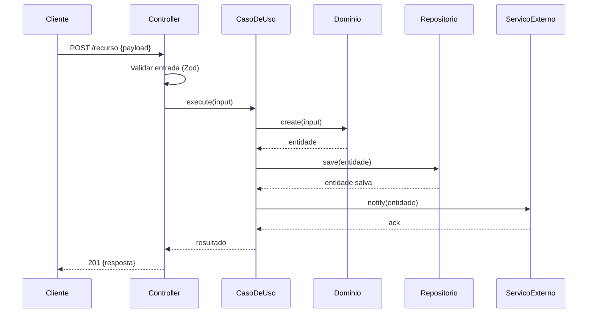
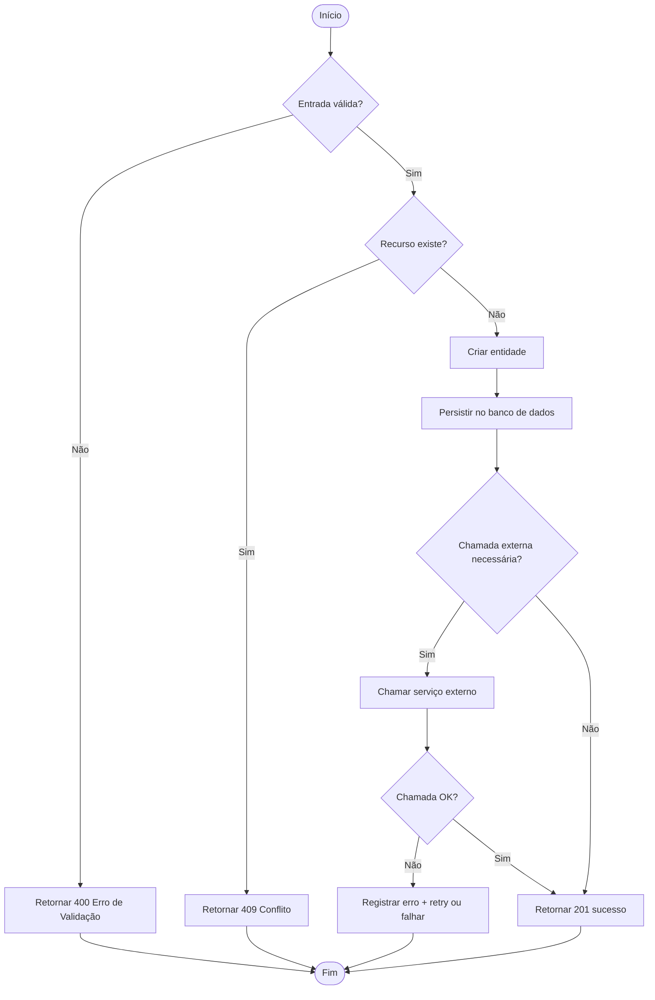

# Design: [NOME DA FEATURE]

> Design arquitetural e decomposição de componentes para [NOME DA FEATURE].

**Feature ID**: [FEAT-XXX]
**Status**: Rascunho | Em Revisão | Aprovado
**Criado Em**: [YYYY-MM-DD]
**Última Atualização**: [YYYY-MM-DD]

---

## 1. Visão Geral Arquitetural

[Descrever a abordagem de alto nível. Quais padrões arquiteturais são aplicados? Como esta feature se encaixa na arquitetura do sistema existente?]

---

## 2. Componentes

| Componente | Camada | Responsabilidade |
|------------|--------|-----------------|
| [ex.: PaymentController] | Interface | Recebe HTTP, valida entrada, delega |
| [ex.: ProcessPaymentUseCase] | Application | Orquestra domínio + efeitos colaterais |
| [ex.: Payment] | Domain | Entidade com regras de negócio de pagamento |
| [ex.: PaymentRepository] | Infrastructure | Persiste registros de pagamento |
| [ex.: StripeGateway] | Infrastructure | Chama a API do Stripe |

---

## 3. Modelo de Dados

### Novas Entidades / Tabelas

```
[NomeDaTabela]
- id: UUID (PK)
- [campo]: [tipo] — [descrição]
- created_at: TIMESTAMP
- updated_at: TIMESTAMP
```

### Entidades / Tabelas Modificadas

| Entidade | Mudança | Motivo |
|----------|---------|--------|
| [User] | Adicionar campo `payment_method_id` | Vincular usuário ao método de pagamento |

---

## 4. Contrato de API

### Endpoints (se aplicável)

#### `POST /[recurso]`

**Requisição:**
```json
{
  "campo": "valor"
}
```

**Resposta (200):**
```json
{
  "id": "uuid",
  "campo": "valor"
}
```

**Respostas de Erro:**
| Status | Código | Condição |
|--------|--------|----------|
| 400 | VALIDATION_ERROR | Entrada inválida |
| 409 | CONFLICT | Recurso já existe |
| 500 | INTERNAL_ERROR | Falha inesperada |

---

## 5. Diagrama de Sequência



---

## 6. Flowchart



---

## 7. Estratégia de Tratamento de Erros

| Cenário | Tipo de Erro | Resposta | Recuperação |
|---------|-------------|----------|-------------|
| Entrada inválida | ValidationError | 400 | Usuário corrige a entrada |
| Recurso duplicado | ConflictError | 409 | Usuário resolve o conflito |
| Falha de serviço externo | IntegrationError | 502 | Retry com backoff |
| Falha inesperada | InternalError | 500 | Log + alerta |

---

## 8. Decisões de Design

| Decisão | Alternativas Consideradas | Justificativa |
|---------|--------------------------|---------------|
| [ex.: Usar chave de idempotência] | [ex.: Sem chave, check-then-act] | [Previne processamento duplicado sob retentativas] |

---

## 9. Rastreabilidade de Requisitos

| Seção do Design | Requisito(s) | Notas |
|-----------------|-------------|-------|
| §2 Componentes | FEAT-XXX-REQ-001 | Satisfaz através de X |
| §4 Contrato de API | FEAT-XXX-REQ-002 | Endpoint POST |

---

## Notas

<!-- Notas de implementação, avisos ou considerações para o agente que irá implementar -->

-
