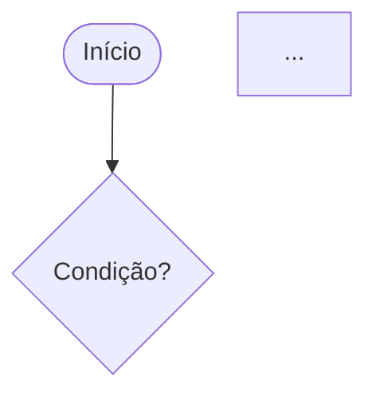

# Script: generate-design

> Gerar o documento de design (`design.md`) para uma feature, incluindo diagramas Mermaid.

---

## Objetivo

Produzir um documento de design completo que capture a abordagem arquitetural, decomposição de componentes, alterações no modelo de dados, contrato de API e diagramas visuais (diagrama de sequência e flowchart). Escrever em `.specs/features/[feature-name]/design.md`. Atualizar STATE.md para `DESIGN_DEFINED`.

---

## Entradas

- `.specs/features/[feature-name]/spec.md` — a especificação aprovada da feature.
- `.specs/features/[feature-name]/context.md` — decisões de design (se existir).
- `.specs/codebase/ARCHITECTURE.md` — padrões arquiteturais existentes.
- `.specs/codebase/STACK.md` — restrições tecnológicas.
- `.specs/codebase/CONVENTIONS.md` — convenções de código.

---

## Pré-condições

1. `spec.md` deve existir para a feature alvo.
2. Ler todos os documentos de entrada antes de começar.
3. O design deve ser consistente com a arquitetura existente documentada em `ARCHITECTURE.md`.

---

## Passos

### Passo 1 — Ler e Internalizar as Entradas

Ler na ordem:
1. `spec.md` — entender todos os requisitos e critérios de aceitação.
2. `context.md` — entender decisões e restrições.
3. `ARCHITECTURE.md` — entender os padrões existentes a seguir.
4. `STACK.md` — entender as restrições tecnológicas.

### Passo 2 — Definir Abordagem Arquitetural

Decidir como esta feature se encaixa na arquitetura existente:
- Quais camadas estão envolvidas?
- São necessários novos componentes, ou os existentes podem ser estendidos?
- Esta feature introduz novas integrações externas?
- Esta feature requer mudanças no schema do banco de dados?

Se uma decisão arquitetural significativa precisar ser tomada e não estiver coberta pela documentação existente, documentá-la no design em "Decisões de Design".

### Passo 3 — Definir Componentes

Para cada componente envolvido:
- Nomeá-lo seguindo as convenções de nomenclatura do projeto.
- Atribuí-lo à camada arquitetural correta.
- Definir sua responsabilidade única.
- Identificar suas entradas e saídas.

### Passo 4 — Definir Mudanças no Modelo de Dados

Para cada entidade ou tabela afetada:
- Documentar novos campos, tipos e restrições.
- Documentar novas tabelas ou coleções.
- Observar implicações de migração.

### Passo 5 — Definir Contrato de API

Para cada interface pública exposta por esta feature (endpoints HTTP, contratos de evento, comandos CLI):
- Definir a estrutura da requisição.
- Definir a resposta de sucesso.
- Definir todas as respostas de erro com códigos de status e códigos de erro.

### Passo 6 — Criar Diagrama de Sequência

Criar um diagrama de sequência Mermaid que mostre o fluxo completo do happy path pelo sistema, do ponto de entrada à persistência/resposta.

Requisitos:
- Incluir todos os componentes definidos no Passo 3.
- Incluir serviços externos se aplicável.
- Mostrar o caminho de resposta de volta ao chamador.
- Usar rótulos claros e descritivos nas setas.

```mermaid
sequenceDiagram
    participant [Ator/Cliente]
    participant [Componente 1]
    ...
    [Ator/Cliente]->>[Componente 1]: [Ação com payload]
    ...
```

### Passo 7 — Criar Flowchart

Criar um flowchart Mermaid que mostre a lógica de decisão e fluxos alternativos (incluindo tratamento de erros).

Requisitos:
- Incluir todos os pontos de decisão.
- Incluir caminhos de erro/exceção.
- Usar rótulos claros nos nós de decisão (`{Condição?}`).
- Iniciar com um nó arredondado `([Início])` e terminar com `([Fim])`.



### Passo 8 — Definir Estratégia de Tratamento de Erros

Para cada cenário de falha identificado:
- Nomear o tipo de erro.
- Definir o código de status HTTP ou código de erro.
- Definir a resposta ao usuário.
- Definir a estratégia de recuperação (retry, fail-fast, fallback).

### Passo 9 — Documentar Decisões de Design

Para cada decisão de design não óbvia:
- Descrever a decisão tomada.
- Listar alternativas que foram consideradas.
- Explicar a justificativa para a abordagem escolhida.

### Passo 10 — Construir Matriz de Rastreabilidade

Mapear cada seção do design de volta aos requisitos de `spec.md`:
- Qual(is) requisito(s) cada componente satisfaz?
- Qual critério de aceitação é coberto por qual decisão de design?

### Passo 11 — Escrever `design.md`

Usando `references/design-template.md` como base, preencher todas as seções com as informações coletadas nos Passos 2–10.

Escrever em: `.specs/features/[feature-name]/design.md`

### Passo 12 — Atualizar `STATE.md`

Chamar `scripts/update-state.md` com:
```
Status: DESIGN_DEFINED
Feature: [feature-name]
Updated At: [timestamp atual]
```

---

## Saídas

- `.specs/features/[feature-name]/design.md` — documento de design completo.
- `.specs/STATE.md` atualizado para `DESIGN_DEFINED`.

---

## Checklist de Qualidade

Antes de considerar o design completo, verificar:

- [ ] Todos os requisitos funcionais de spec.md estão endereçados no design.
- [ ] Todos os requisitos não funcionais estão endereçados (performance, segurança, escalabilidade).
- [ ] O diagrama de sequência cobre o fluxo completo do happy path.
- [ ] O flowchart cobre todos os pontos de decisão incluindo caminhos de erro.
- [ ] As mudanças no modelo de dados estão totalmente especificadas.
- [ ] Os contratos de API estão totalmente especificados (requisição + resposta + erros).
- [ ] A estratégia de tratamento de erros está definida para todos os cenários de falha.
- [ ] O design é consistente com ARCHITECTURE.md.
- [ ] Todas as decisões de design estão documentadas com justificativa.
- [ ] A matriz de rastreabilidade está completa.

---

## Tratamento de Erros

- Se `spec.md` estiver incompleto ou ambíguo, não adivinhar — voltar a `generate-sdd.md` e resolver as lacunas primeiro.
- Se uma decisão de design contradizer a arquitetura existente, sinalizá-la explicitamente e pedir orientação ao usuário antes de prosseguir.
- Se um diagrama Mermaid se tornar muito complexo (mais de 15 nós), dividi-lo em sub-diagramas com títulos claros.
