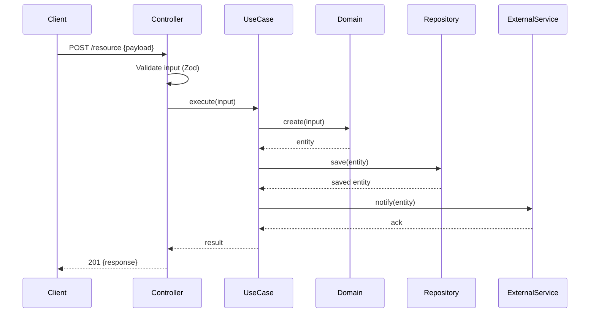
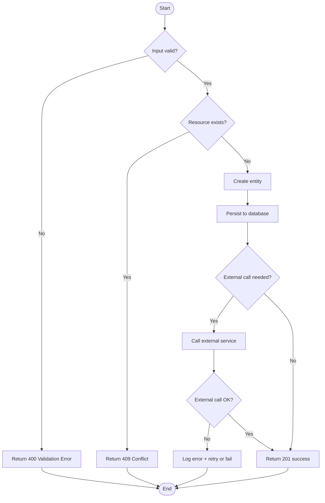

# Design: [FEATURE NAME]

> Architectural design and component breakdown for [FEATURE NAME].

**Feature ID**: [FEAT-XXX]
**Status**: Draft | Under Review | Approved
**Created At**: [YYYY-MM-DD]
**Last Updated**: [YYYY-MM-DD]

---

## 1. Architectural Overview

[Describe the high-level approach. What architectural patterns are applied? How does this feature fit into the existing system architecture?]

---

## 2. Components

| Component | Layer | Responsibility |
|-----------|-------|----------------|
| [e.g., PaymentController] | Interface | Receives HTTP, validates input, delegates |
| [e.g., ProcessPaymentUseCase] | Application | Orchestrates domain + side effects |
| [e.g., Payment] | Domain | Entity with payment business rules |
| [e.g., PaymentRepository] | Infrastructure | Persists payment records |
| [e.g., StripeGateway] | Infrastructure | Calls Stripe API |

---

## 3. Data Model

### New Entities / Tables

```
[TableName]
- id: UUID (PK)
- [field]: [type] — [description]
- created_at: TIMESTAMP
- updated_at: TIMESTAMP
```

### Modified Entities / Tables

| Entity | Change | Reason |
|--------|--------|--------|
| [User] | Add `payment_method_id` field | Link user to payment method |

---

## 4. API Contract

### Endpoints (if applicable)

#### `POST /[resource]`

**Request:**
```json
{
  "field": "value"
}
```

**Response (200):**
```json
{
  "id": "uuid",
  "field": "value"
}
```

**Error Responses:**
| Status | Code | Condition |
|--------|------|-----------|
| 400 | VALIDATION_ERROR | Invalid input |
| 409 | CONFLICT | Resource already exists |
| 500 | INTERNAL_ERROR | Unexpected failure |

---

## 5. Sequence Diagram



---

## 6. Flowchart



---

## 7. Error Handling Strategy

| Scenario | Error Type | Response | Recovery |
|----------|------------|----------|---------|
| Invalid input | ValidationError | 400 | User corrects input |
| Duplicate resource | ConflictError | 409 | User resolves conflict |
| External service failure | IntegrationError | 502 | Retry with backoff |
| Unexpected failure | InternalError | 500 | Log + alert |

---

## 8. Design Decisions

| Decision | Alternatives Considered | Rationale |
|----------|------------------------|-----------|
| [e.g., Use idempotency key] | [e.g., No key, check-then-act] | [Prevents duplicate processing under retries] |

---

## 9. Requirements Traceability

| Design Section | Requirement(s) | Notes |
|----------------|----------------|-------|
| §2 Components | FEAT-XXX-REQ-001 | Satisfies through X |
| §4 API Contract | FEAT-XXX-REQ-002 | POST endpoint |

---

## Notes

<!-- Implementation notes, warnings, or considerations for the implementing agent -->

-
