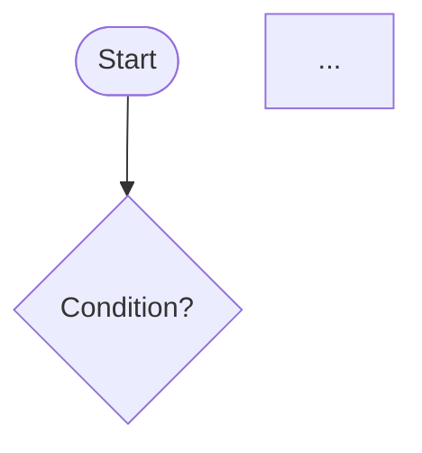

# Script: generate-design

> Generate the design document (`design.md`) for a feature, including Mermaid diagrams.

---

## Objective

Produce a complete design document that captures the architectural approach, component breakdown, data model changes, API contract, and visual diagrams (sequence diagram and flowchart). Write to `.specs/features/[feature-name]/design.md`. Update STATE.md to `DESIGN_DEFINED`.

---

## Inputs

- `.specs/features/[feature-name]/spec.md` — the approved feature specification.
- `.specs/features/[feature-name]/context.md` — design decisions (if exists).
- `.specs/codebase/ARCHITECTURE.md` — existing architectural patterns.
- `.specs/codebase/STACK.md` — technology constraints.
- `.specs/codebase/CONVENTIONS.md` — coding conventions.

---

## Pre-conditions

1. `spec.md` must exist for the target feature.
2. Read all input documents before starting.
3. The design must be consistent with the existing architecture documented in `ARCHITECTURE.md`.

---

## Steps

### Step 1 — Read and Internalize Inputs

Read in order:
1. `spec.md` — understand all requirements and acceptance criteria.
2. `context.md` — understand decisions and constraints.
3. `ARCHITECTURE.md` — understand existing patterns to follow.
4. `STACK.md` — understand technology constraints.

### Step 2 — Define Architectural Approach

Decide how this feature fits into the existing architecture:
- Which layers are involved?
- Are new components needed, or can existing ones be extended?
- Does this feature introduce new external integrations?
- Does this feature require database schema changes?

If a significant architectural decision needs to be made that is not covered by existing documentation, document it in the design under "Design Decisions."

### Step 3 — Define Components

For each component involved:
- Name it following the project's naming conventions.
- Assign it to the correct architectural layer.
- Define its single responsibility.
- Identify its inputs and outputs.

### Step 4 — Define Data Model Changes

For each entity or table affected:
- Document new fields, types, and constraints.
- Document new tables or collections.
- Note any migration implications.

### Step 5 — Define API Contract

For each public interface exposed by this feature (HTTP endpoints, event contracts, CLI commands):
- Define the request structure.
- Define the success response.
- Define all error responses with status codes and error codes.

### Step 6 — Create Sequence Diagram

Create a Mermaid sequence diagram that shows the complete happy-path flow through the system, from the entry point to persistence/response.

Requirements:
- Include all components defined in Step 3.
- Include external services if applicable.
- Show the response path back to the caller.
- Use clear, descriptive labels on arrows.

```mermaid
sequenceDiagram
    participant [Actor/Client]
    participant [Component 1]
    ...
    [Actor/Client]->>[Component 1]: [Action with payload]
    ...
```

### Step 7 — Create Flowchart

Create a Mermaid flowchart that shows the decision logic and alternative flows (including error handling).

Requirements:
- Include all decision points.
- Include error/exception paths.
- Use clear labels on decision nodes (`{Is condition?}`).
- Start with a rounded `([Start])` and end with rounded `([End])` nodes.



### Step 8 — Define Error Handling Strategy

For each identified failure scenario:
- Name the error type.
- Define the HTTP status code or error code.
- Define the user-facing response.
- Define the recovery strategy (retry, fail-fast, fallback).

### Step 9 — Document Design Decisions

For each non-obvious design decision:
- Describe the decision made.
- List alternatives that were considered.
- Explain the rationale for the chosen approach.

### Step 10 — Build Traceability Matrix

Map each design section back to the requirements from `spec.md`:
- Which requirement(s) does each component satisfy?
- Which acceptance criterion is covered by which design decision?

### Step 11 — Write `design.md`

Using `references/design-template.md` as the base, populate all sections with the information gathered in Steps 2–10.

Write to: `.specs/features/[feature-name]/design.md`

### Step 12 — Update `STATE.md`

Call `scripts/update-state.md` with:
```
Status: DESIGN_DEFINED
Feature: [feature-name]
Updated At: [current timestamp]
```

---

## Outputs

- `.specs/features/[feature-name]/design.md` — complete design document.
- `.specs/STATE.md` updated to `DESIGN_DEFINED`.

---

## Quality Checklist

Before considering the design complete, verify:

- [ ] All functional requirements from spec.md are addressed in the design.
- [ ] All non-functional requirements are addressed (performance, security, scalability).
- [ ] Sequence diagram covers the complete happy-path flow.
- [ ] Flowchart covers all decision points including error paths.
- [ ] Data model changes are fully specified.
- [ ] API contracts are fully specified (request + response + errors).
- [ ] Error handling strategy is defined for all failure scenarios.
- [ ] Design is consistent with ARCHITECTURE.md.
- [ ] All design decisions are documented with rationale.
- [ ] Traceability matrix is complete.

---

## Error Handling

- If `spec.md` is incomplete or ambiguous, do not guess — go back to `generate-sdd.md` and resolve the gaps first.
- If a design decision contradicts the existing architecture, flag it explicitly and ask the user for guidance before proceeding.
- If a Mermaid diagram becomes too complex (more than 15 nodes), split it into sub-diagrams with clear titles.
